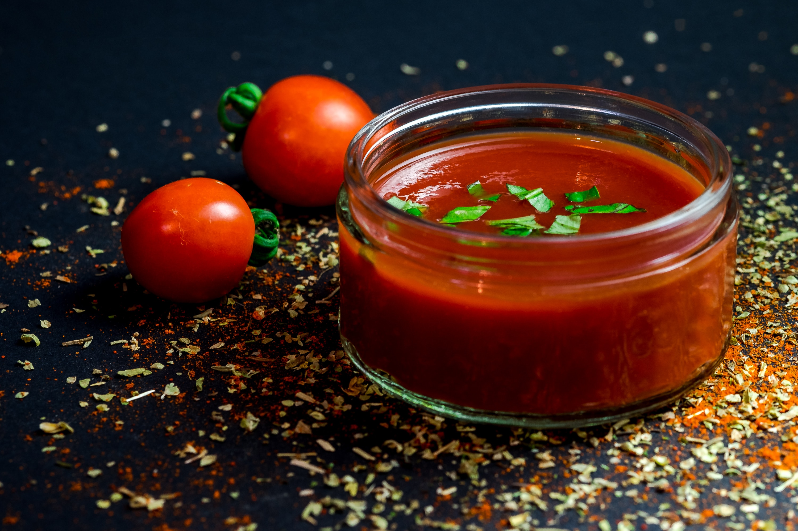

# MENU
## PIZZE

|  |Pizza                                                                                       |Rozmiar:     | mała | średnia | duża |
|--|--------------------------------------------------------------------------------------------|-------------|------|---------|------|
|1.| Kryzysowa (ketchup, szynka, ser, średni rozmiar do tego śrendia w smaku)                   |             |   -  |   12zł  |  -   |
|2.| Marinara (polpa pomidorowa, czosnek, oregano, oliwa z oliwek)                              |             | 22zł |    -    | 26zł |
|3.| Margherita (polpa pomidorowa, mozarella, bazylia)                                          |             | 22zł |    -    | 26zł |
|4.| Funghi (polpa pomidorowa, mozarella, grzyby tymianek)                                      |             | 24zł |    -    | 30zł |
|5.| Americana (polpa pomidorowa, mozarella, grzyby, salami **pikantne**, tymianek)             |             | 22zł |    -    | 26zł |
|6.| Bianca (sos bianco, mozarella, boczek pancetta, szpinak, czosnek)                          |             | 28zł |    -    | 32zł |
|7.| Mexicana (**JALAPENO**) (polpa pomidorowa, mozarella, cebula, szynka, papryka **jalapeno**)|             | 22zł |    -    | 26zł |
|8.| Kebab (polpa pomidorowa, mozarella, mieso wołowe, rukola, pomidorki koktajlowe, parmezan)  |             | 26zł |    -    | 30zł |

## BURGERY

|  |Burger                                                                                              |Cena:  |
|--|----------------------------------------------------------------------------------------------------|-------|
|1.| Manhattan (boczek, ser chedar, ogórek konserwowy, cebula, sałata, sos BBG, majonez)                |  24zł |
|2.| Chilli (nachosy, chutney z cebulą, rukola, sos guacamole, sos chili)                               |  22zł |
|3.| Popeye (mozarella, suszone pomidory, migdały, szalotka, szpinak, sos koperkowy)                    |  26zł |
|4.| Ogrodnik (mozarella, cukinia, pomidor, cebula(dużo cebuli), szpinak, sos guacamole, sos koperkowy) |  27zł |

## SOSY

|  |Sos            |Cena:  |
|--|---------------|-------|
|1.| Czosnkowy     |  4zł  |
|2.| Ostry         |  5zł  |
|3.| Bardzo Ostry  |  5zł  |
|4.| Ketchup       |  3zł  |
|5.| Tysiąca Wysp  |  4zł  |
|6.| Majonezowy    |  5zł  |

## NAPOJE

|  |Napoje          |Cena:  |
|--|----------------|-------|
|1.|Coca Cola       |  9zł  |
|2.|Pepsi           |  8zł  |
|3.|Fanta           |  7zł  |
|4.|Mirinda         |  8zł  |
|5.|Sprite          |  7zł  |
|6.|Woda mineralna  |  5zł  |
